<h1 style="color:#007ac9;border-bottom:none;text-align:center;">Intive Patronage 2022</h1>
<h2 style="text-align:center;border-bottom:none">Wrocław JavaScript Project</h2>

## Table of Contents

- [General Info](#general-information)
- [Technologies Used](#technologies-used)
- [Features](#features)
- [Screenshots](#screenshots)
- [Setup](#setup)
- [Usage](#usage)
- [Project Status](#project-status)
- [Room for Improvement](#room-for-improvement)
- [Contact](#contact)

## General Information

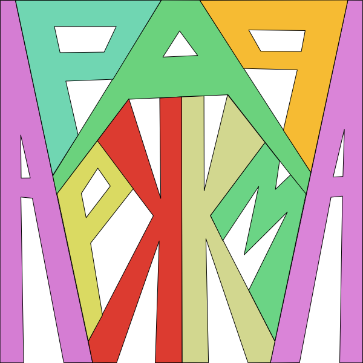

<h1 align="center">
Patronage Site
</h1>

- An app based on [Mentimeter](https://www.mentimeter.com)
- It let's you make your presentation more fun and interactive
- Simply log in, create a form, share and watch what happens
- Every participant with a link can answer the questions and see live results

## Technologies Used

- [Nx](https://nx.dev) 
- [React](https://reactjs.org) 
- [TypeScript](https://www.typescriptlang.org) 
- [MUI](https://mui.com) 
- [styled components](https://styled-components.com) 
- [Redux Toolkit](https://redux-toolkit.js.org) 
- [i18next](https://www.i18next.com) 
- [Firebase](https://firebase.google.com) 
- [Storybook](https://storybook.js.org) 
- [Cypress](https://go.cypress.io/get-started?utm_adgroup=128583766023&utm_keyword=cypress&utm_source=google&utm_medium=cpc&utm_campaign=15310628554&utm_term=cypress&hsa_acc=8898574980&hsa_cam=15310628554&hsa_grp=128583766023&hsa_ad=562833928007&hsa_src=g&hsa_tgt=kwd-109225769&hsa_kw=cypress&hsa_mt=p&hsa_net=adwords&hsa_ver=3&gclid=Cj0KCQjw3v6SBhCsARIsACyrRAkB_R9rBQt8-gMUoIKAWwxMZZJpT6VI--Jehq9-KN-pwlsTPEopHFkaAsZ7EALw_wcB) 
- [Prettier](https://prettier.io) 
- [ESLint](https://eslint.org) 

### Other
- [React Router](https://reactrouter.com)
- [React Hook Form](https://react-hook-form.com)
- [React QR Code](https://github.com/rosskhanas/react-qr-code)
- [Yup](https://github.com/jquense/yup)
- [Lodash](https://lodash.com)
- [Chart.js](https://www.chartjs.org)
- [Fuze.js](https://fusejs.io)
## Features

- Log in with Google Account
- Create form with open and closed questions
- Share link with saved form
- Fill the form
- See live results of shared form
- Search saved form
- Switch beetween dark and light mode
- Change language :poland: :uk:/:us:/:australia:

## Screenshots

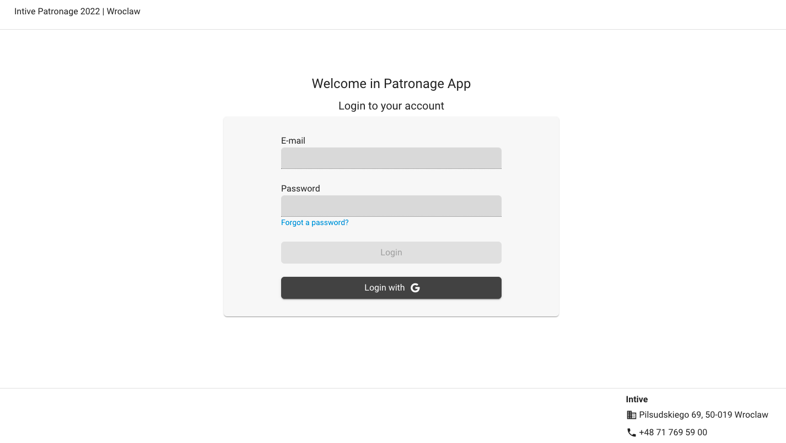
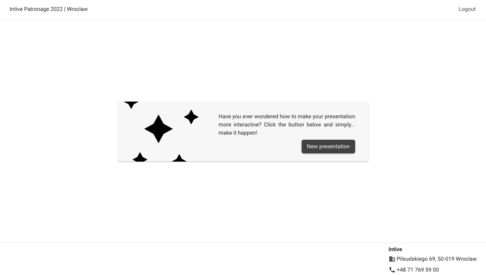
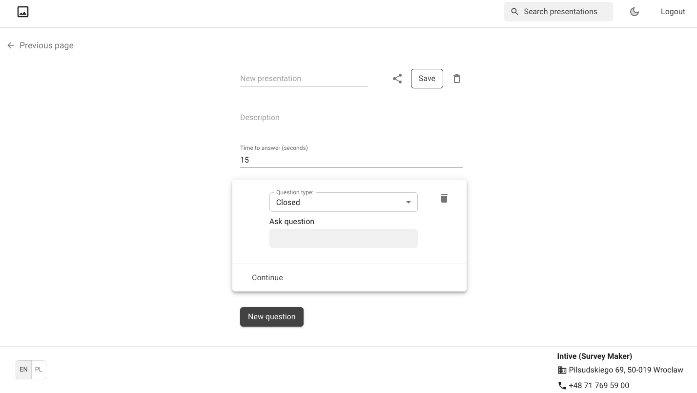
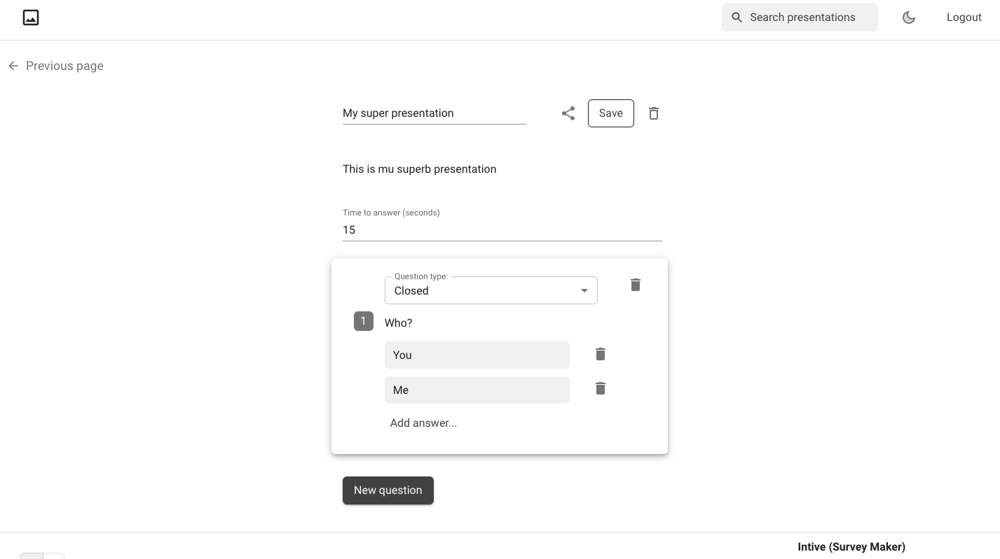
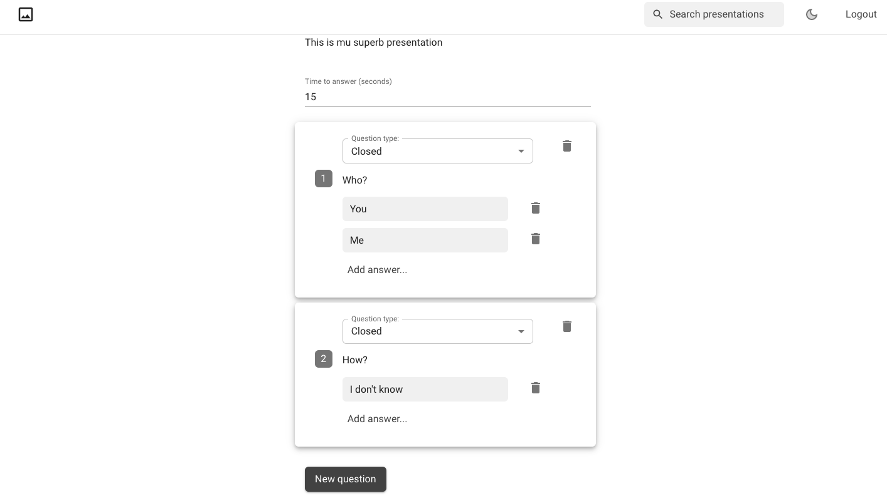
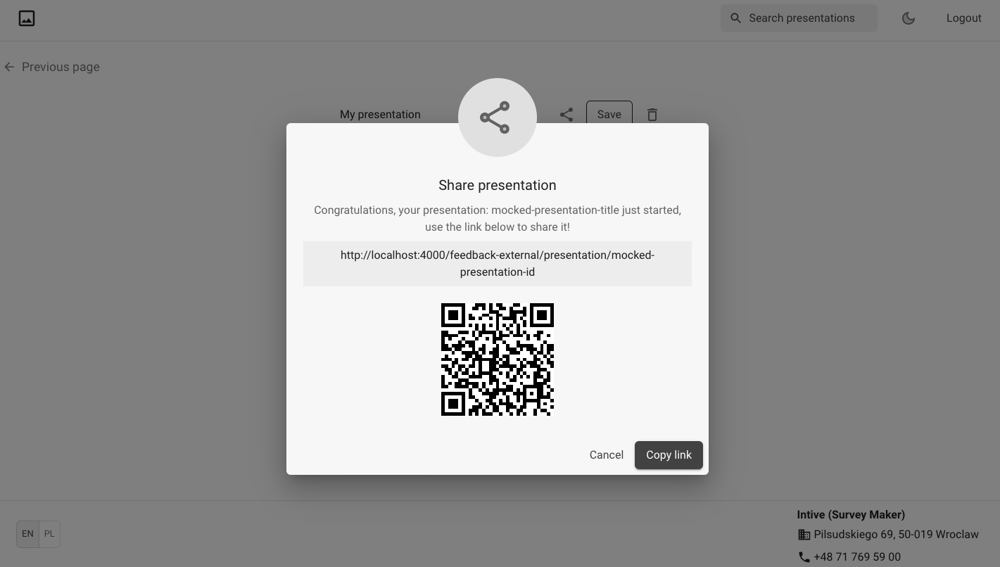
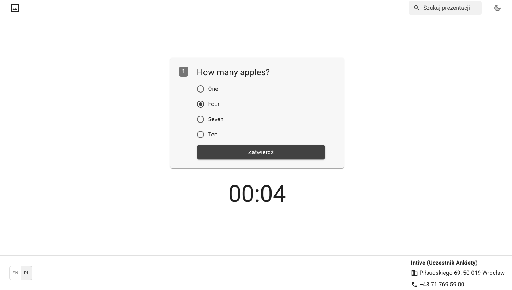
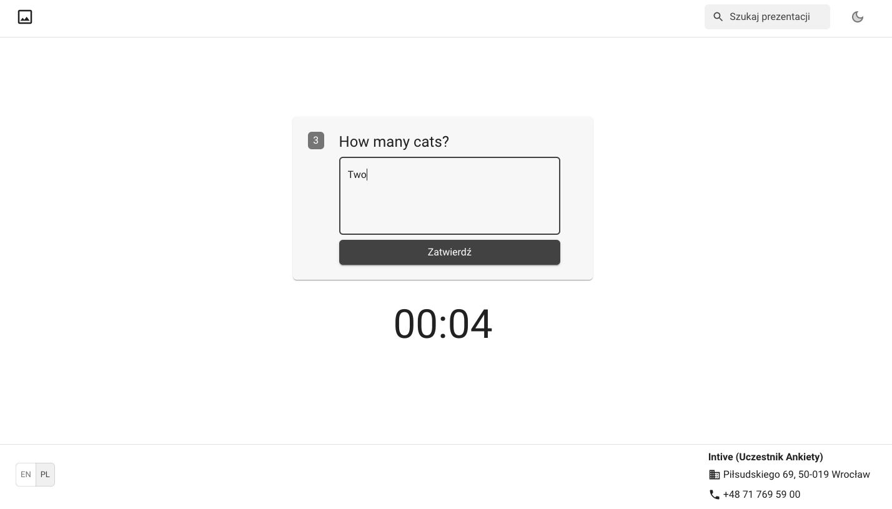
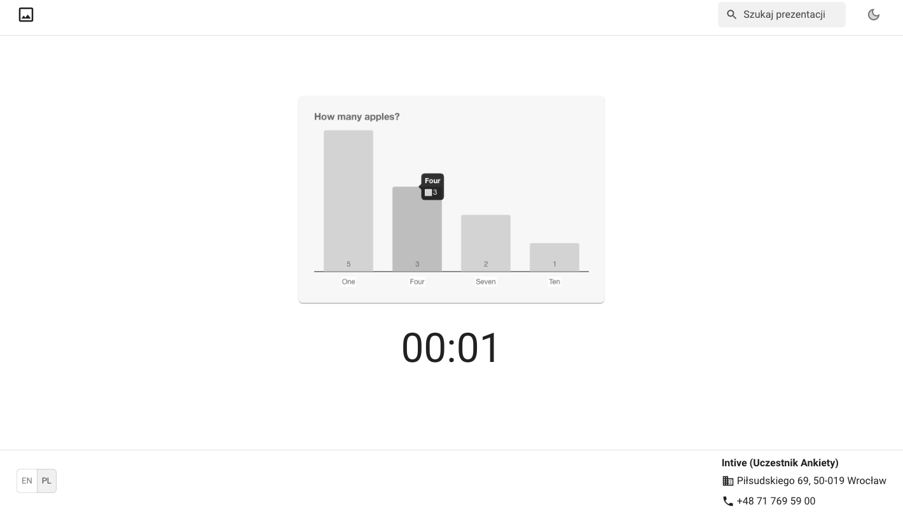
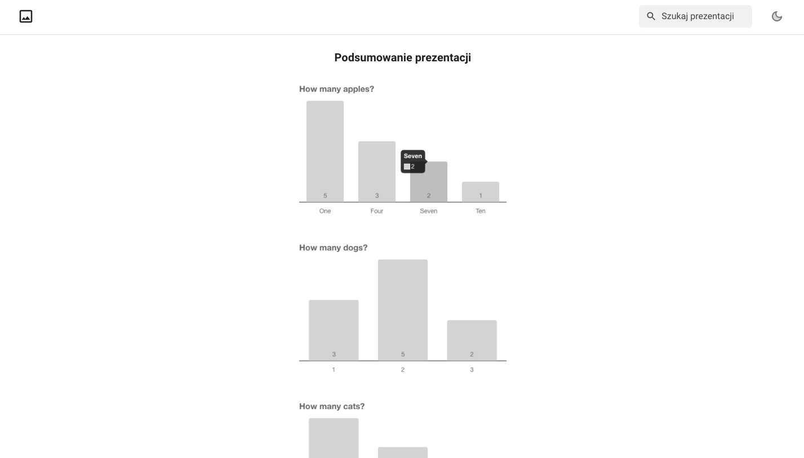
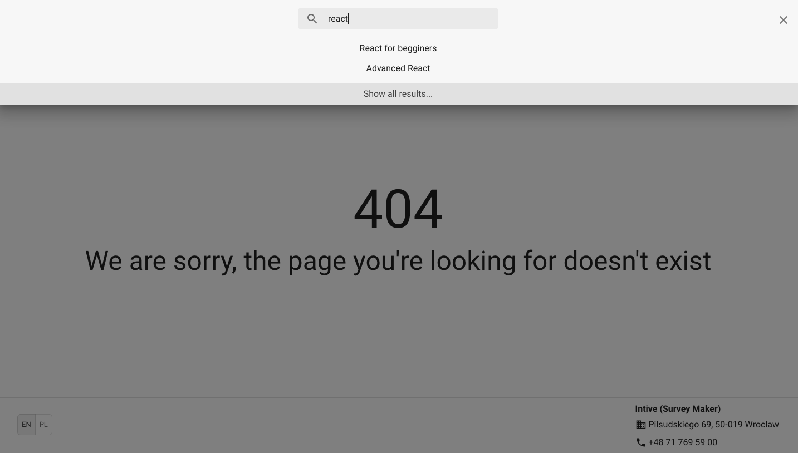
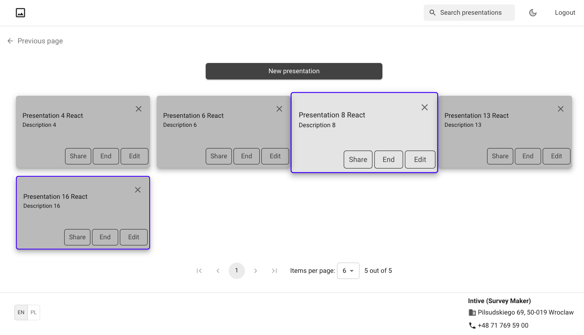
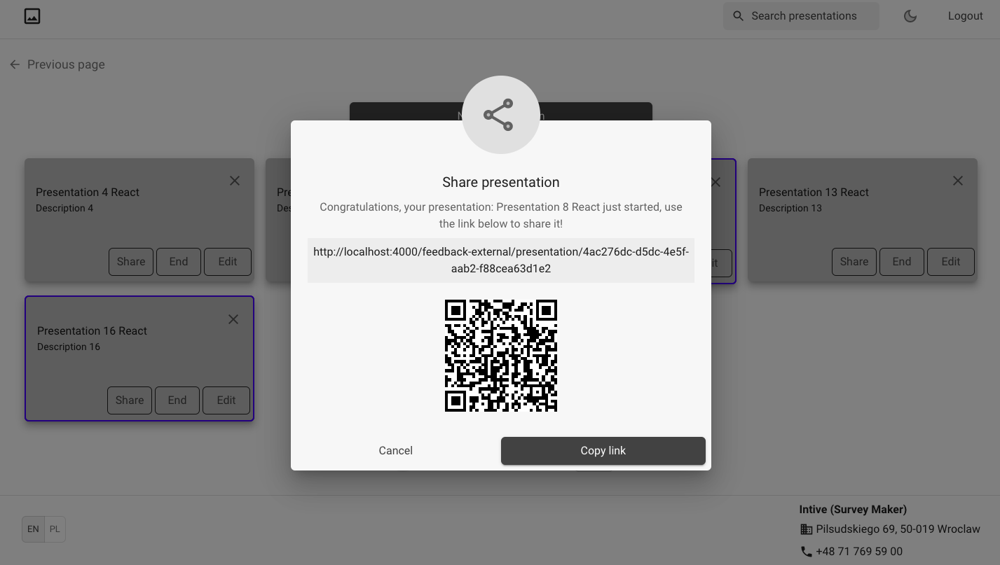
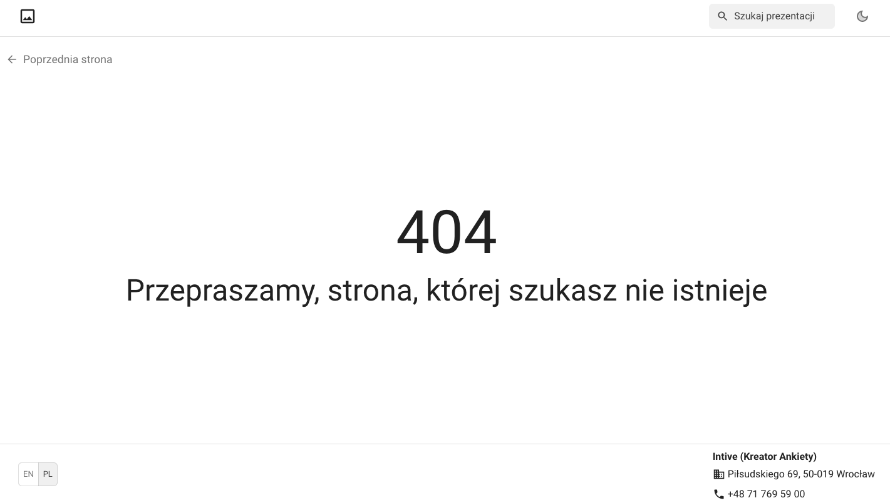
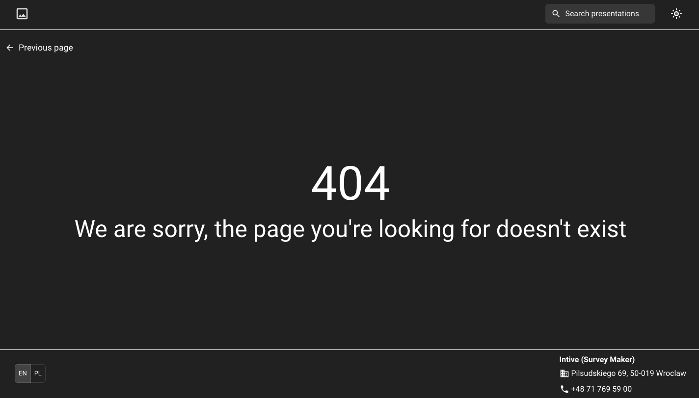

## Setup

Run `yarn` to install all dependencies needed for this project. They are listed in `package.json` file.

## Usage

`yarn start` - to run the app

`yarn storybook ui:storybook` - to run storybook

`yarn e2e site-e2e` - to run e2e tests

The server is running on port 4000

## Project Status

Project is done but with room for improvement :tada:

======================================================

## Style Guide

### Code standards:

1.  https://github.com/airbnb/javascript
2.  https://github.com/airbnb/javascript/tree/master/react

### JavaScript & React rules to be highlighted:

- We prefer using EcmaScript 2015 - 2021
- We use arrow functions
- We prefer hooks and functional components
- We follow KISS and DRY and AHA rules
- We think about interface first, then build component
- We think mobile first, then go up with building styles
- We make empty line between HTML elements on the same hierarchy level if HTML is complex
- We do not use "magic numbers"
- We have in mind SOLID principles (https://github.com/ryanmcdermott/clean-code-javascript)
- If it comes to styles, we follow BEM rules (https://css-tricks.com/bem-101/)
- We add underscore to variables that are not used but required (throwaway variable), for instance:
  ( \_notUsedVariable: any, usedVariable: any) => {
  const result = usedVariable + 1

  return result
  }

### Naming conventions:

- Folders and files should have names with lowercase (kebab case) (https://betterprogramming.pub/string-case-styles-camel-pascal-snake-and-kebab-case-981407998841)
- Each component should has own folder, inside should be 'index' with component inside or export if more files than 1
- If it comes to variables and functions names: https://github.com/airbnb/javascript#naming-conventions
  - Variable names should be descriptive. Reader should know meaning based on read.
  - For actions that are passed as props use 'onSomeName' and for functions that defines actions inside components use 'handleSomeName'.
  - Methods names - please use verbs - ex. "getAllHeaders"
  - Variables names:
    - For boolean variables please question-like names - ex. "hasProperValue", "shouldContainValue", "isProperElement"
    - For other variables please use noun-like names - ex. "mainTitle", "footer"
  - We use UPPERCASE if it comes to CONSTANTS names

### Component properties order:

- We put useEffects just above render method (or return)

### Translations order:

- We sort them alphabetical ASC

### Meaning of constants.ts:

- Reausable global variables
- This file should be central-place of all important meaning variables which are used in multiple places in application

### Styling

- We use styled components (https://mui.com/pt/system/styled/)
- We use [_css-in-js_](https://cssinjs.org/?v=v10.9.0)
- We keep styles definitions in separate files within component folder
- Naming convention - styled components should have names relevant to intended use and have prefix which determines type of the styled component.

  Sample:

  - OutlinedButton
  - ContainedButton

- Importing - import styled components implicitly:

  Sample:

  import \* as Styled from "./styled";

  Usage:

  <Styled.OutlinedButton>...</Styled.OutlinedButton>

======================================================

## Git-Flow

- master (production)
- develop
- feature/\*
- release/\*
- bugfix/\*
- hotfix/\*

## Room for Improvement

Room for improvement:

- Pay more attention to naming
- Write less complicated code

To do:

- Functionality of editing, deleting and properly saving forms
- Add react-first-router
- Create homepage
- ...

## Contributors

[@Adys23](https://github.com/Adys23)

[@aniasgit](https://github.com/aniasgit)

[@krysia1](https://github.com/krysia1)

[@malmon305](https://github.com/malmon305)

[@pawelwojdas](https://github.com/pawelwojdas)

[@piotrrawski](https://github.com/piotrrawski)

[@Reden4005](https://github.com/Reden4005)

### Team Leaders

[@FabianHoffmannIntive](https://github.com/FabianHoffmannIntive)

[@kacperChlon](https://github.com/kacperChlon)

[@piotrpalus](https://github.com/piotrpalus)

## Contact

Created by [@intive](https://www.intive.com/) - feel free to contact us!
